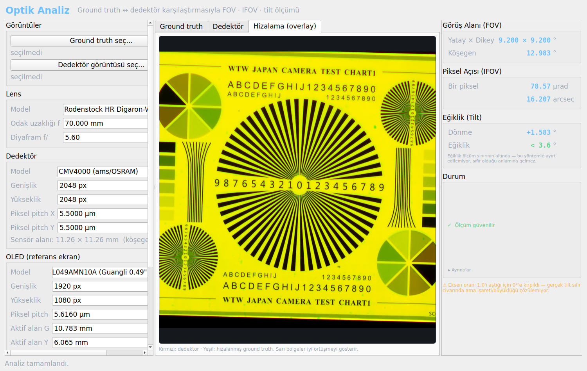

# Optik Analiz Otomasyonu

Ground truth ile dedektör görüntüsünü karşılaştırarak **FOV**, **IFOV** ve **tilt**
değerlerini otomatik hesaplayan PyQt5 masaüstü uygulaması.

| Parametre | Anlamı |
|---|---|
| **FOV** (Field of View) | Sensörün gördüğü toplam açı |
| **IFOV** (Instantaneous FOV) | Tek bir pikselin gördüğü açı |
| **Tilt** | Görüntüdeki eğiklik — düzlem-içi dönme ve düzlem-dışı perspektif |

Tasarım **parametriktir**: hiçbir donanım değeri koda gömülü değildir. Lens,
dedektör veya OLED değişirse arayüzdeki alanları güncellemek yeterlidir.



## Kurulum

Python 3.12 ve şu paketler:

```
OpenCV 4.13 · NumPy 1.26 · SciPy 1.11 · PyQt5 5.15 · matplotlib 3.10
```

```bash
pip install opencv-python numpy scipy PyQt5 matplotlib
```

## Çalıştırma

```bash
python3 run_gui.py
```

VS Code'da **F5** → "Arayüzü başlat (GUI)" de aynı işi yapar.

Arayüzde: **Ground truth seç…** → **Dedektör görüntüsü seç…** → **ANALİZ ET**.
Sonuçlar sağ panelde görünür.

## Testler

```bash
python3 test_tilt_synth.py   # Sentetik doğrulama (görüntü gerekmez)
python3 test_tilt_multi.py   # Ölçüm katmanı: doğruluk + dürüstlük
python3 test_pipeline.py     # Uçtan uca test (örnek görüntülerle)
python3 test_core.py         # Çekirdek FOV/IFOV matematiği
```

Sentetik doğrulamada 0°–40° arasında en büyük hata 0.29°.

`test_tilt_multi.py` ayrıca **dürüstlüğü** sınar: desensiz bir görüntü
verildiğinde sistem "ölçülemedi" demeli, sıfır üretmemelidir.

## Ölçüm yöntemi

**FOV / IFOV** — kollimatör olmadığı için pinhole kamera modeli:

```
IFOV = 2 · arctan( pitch / (2f) )
FOV  = 2 · arctan( (N · pitch) / (2f) )
```

**Tilt** — test chart'ının merkezindeki Siemens star gerçekte bir dairedir;
eğik düzlemde elipse dönüşür:

```
eksen oranı (b/a) = cos(tilt) → tilt = arccos(b/a)
```

Bu ilişki ölçek ve kırpmadan bağımsızdır. Düzlem-içi dönme ise SIFT
eşleşmelerinden gelen homografinin QR ayrıştırmasıyla bulunur.

### Ölçüm sınırı

Kosinüs sıfır civarında yassı olduğu için elips yöntemi küçük açılara
duyarsızdır: 1° eğiklik eksen oranını yalnızca 0.00015 değiştirir. Tipik
oran gürültüsü (σ ≈ 0.002) bunun karşılığı olan **~3.6°**'ye kadar olan
eğiklikleri gizler.

Bu yüzden yazılım küçük açılarda kesin bir sayı yerine üst sınır raporlar:

```
Eğiklik    < 3.6°
           ölçüm sınırının altında — ayırt edilemiyor
```

> `< 3.6°`, "tilt sıfır" demek **değildir**; "tilt bu değerden küçük, tam
> sayısı bu yöntemle çıkarılamıyor" demektir.

Ölçüm katmanı (`core/tilt_estimators.py`) her yöntemin belirsizliğini
hesaplar, desen tespit güveni 0.7'nin altındaysa ölçüm üretmez ve
doğrulanmamış yöntemleri birincil olarak seçmez — olmayan desenden sayı
uydurulmaz.

## Sonuca güvenilir mi?

Sağ paneldeki **Durum** satırı bu soruyu tek satırda cevaplar:

| Gösterge | Anlamı |
|---|---|
| 🟢 Ölçüm güvenilir | Desen net bulundu, hizalama sağlam |
| 🟡 Dikkat | Ölçüm yapıldı ama bir zayıflık var |
| 🔴 Sonuca güvenmeyin | Desen seçilemedi |

Sarı/kırmızı durumda üç kontrol:

1. **Overlay sekmesi** — geniş sarı alanlar iyi hizalama demektir. Kırmızı/yeşil
   ayrışmışsa tilt değerine güvenmeyin.
2. **Elipsin yeri** — yeşil elips merkezi yıldızın dış sınırına oturmalıdır.
3. **Tespit güveni** — `▸ Ayrıntılar` altında; 0.7 altındaysa yıldız net
   seçilememiştir.

## Dokümantasyon

Ayrıntılı kullanım kılavuzu `docs/` altında üç biçimde:

- [`docs/KULLANIM_KILAVUZU.md`](docs/KULLANIM_KILAVUZU.md) — GitHub'da doğrudan okunur
- `docs/KULLANIM_KILAVUZU.pdf` — yazdırmak/paylaşmak için (14 sayfa)
- `docs/KULLANIM_KILAVUZU.html` — tarayıcıda okumak için

Geliştirme durumu ve teknik notlar: [`DEVAM_YONERGESI.md`](DEVAM_YONERGESI.md)

## Proje yapısı

```
optik_analiz/
├── core/
│   ├── config.py          Parametrik config (Lens/Detector/OLED) + JSON
│   ├── optics.py          FOV/IFOV hesabı + homografi ayrıştırma
│   ├── image_analysis.py  SIFT eşleme, ayna tespiti, dejenerelik denetimi
│   ├── siemens_star.py    Elips-fit tilt ölçümü
│   ├── tilt_estimators.py Çoklu tilt yöntemi + belirsizlik raporlama
│   └── pipeline.py        Tüm akışı birleştiren giriş noktası
├── gui/
│   ├── main_window.py     Ana pencere (3 panel + arka plan thread)
│   └── widgets.py         Tema, görüntü göstericisi, sonuç satırları
├── docs/                  Kullanım kılavuzu (md/html/pdf) + görseller
├── presets/               Preset JSON'ları
├── data/                  Debug/önizleme çıktıları
├── run_gui.py             ← Arayüzü başlatır
└── test_*.py              Testler
```

## Donanım

| Bileşen | Model | Kritik değerler |
|---|---|---|
| Lens | Rodenstock HR Digaron-W | f = 70 mm, f/5.6 |
| Dedektör | CMV4000 (ams/OSRAM) | 2048×2048 px, pitch 5.5 µm |
| OLED | GL049AMN10A (Guangli 0.49") | 1920×1080, pitch 5.616 µm |

Düzenek kollimatörsüzdür — pinhole kamera modeli kullanılır.
