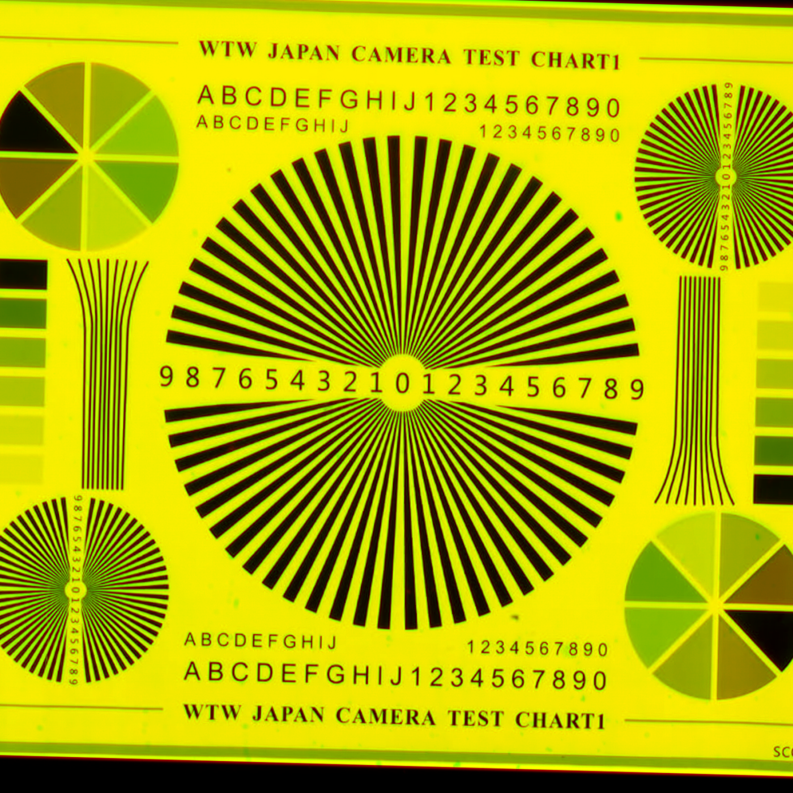
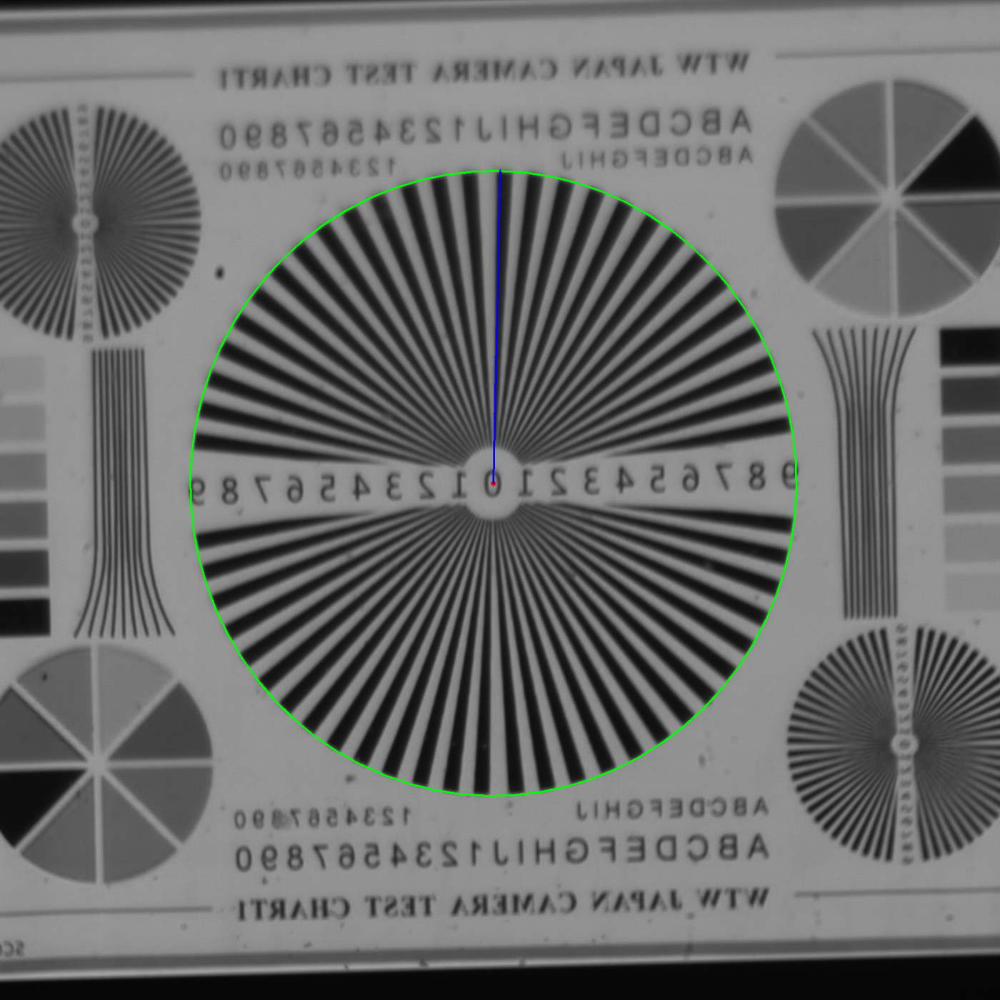

**Sürüm:** 1.0 · **Tarih:** 12 Ağustos 2026
**Proje konumu:** `/home/test123/Desktop/optik_analiz/`

---

## 1. YAZILIM NE YAPAR?

İki görüntüyü karşılaştırır:

- **Ground truth (GT):** OLED ekrana yansıtılan, bilinen test deseni (WTW Camera Test Chart)
- **Dedektör görüntüsü:** Lens + dedektör üzerinden çekilen gerçek görüntü

Bu karşılaştırmadan üç optik parametreyi **otomatik** hesaplar:

| Parametre | Anlamı |
|---|---|
| **FOV** (Field of View) | Sensörün gördüğü toplam açı |
| **IFOV** (Instantaneous FOV) | Tek bir pikselin gördüğü açı |
| **Tilt** | Görüntüdeki eğiklik — hem düzlem-içi dönme hem düzlem-dışı perspektif |

### Tasarımın temel ilkesi: PARAMETRİK

Hiçbir donanım değeri koda gömülü değildir. Lens, dedektör veya OLED değişirse
**sadece arayüzdeki alanları güncellersiniz** — matematik otomatik olarak yeni
değerlere göre kurulur.

### Mevcut donanım

| Bileşen | Model | Kritik değerler |
|---|---|---|
| Lens | Rodenstock HR Digaron-W | f = 70 mm, f/5.6 |
| Dedektör | CMV4000 (ams/OSRAM) | 2048×2048 px, pitch 5.5 µm (11.26×11.26 mm) |
| OLED | GL049AMN10A (Guangli 0.49") | 1920×1080, pitch 5.616 µm |

**Düzenek:** Kollimatör YOK → pinhole (delik-iğne) kamera modeli kullanılıyor.

---

## 2. PROJEYİ VS CODE'DA AÇMA

### Yol A — Terminalden

```bash
code /home/test123/Desktop/optik_analiz
```

### Yol B — VS Code arayüzünden

`File → Open Folder…` → `/home/test123/Desktop/optik_analiz` → **Open**

> Proje zaten VS Code'da açıksa, sol taraftaki dosya ağacında `core/`, `gui/`,
> `presets/` klasörlerini görürsünüz.

---

## 3. ARAYÜZÜ BAŞLATMA

İki yol vardır; ikisi de aynı işi yapar.

### Yol A — VS Code içinden (en kolay)

**F5** tuşuna basın. Hazır yapılandırma listesi açılır:

| Yapılandırma | Ne yapar |
|---|---|
| **Arayüzü başlat (GUI)** | ← Normalde bunu kullanın |
| Uçtan uca test (görüntülerle) | Örnek görüntülerle tam akışı koşturur |
| Sentetik tilt doğrulaması | Ölçüm doğruluğunu sınar (görüntü gerekmez) |
| Çekirdek test | Sadece matematiği sınar |

### Yol B — Terminalden

VS Code'da **Ctrl + `** (backtick) ile terminal açın:

```bash
cd /home/test123/Desktop/optik_analiz
python3 run_gui.py
```

---

## 4. ARAYÜZÜ KULLANMA — 4 ADIM

Pencere açıldığında üç panel görürsünüz: **sol** (girdi), **orta** (görüntüler),
**sağ** (sonuçlar).


---

### ADIM 1 — Görüntüleri seçin (sol üst)

- **"Ground truth seç…"** → referans desen görüntüsü
- **"Dedektör görüntüsü seç…"** → dedektörden çekilen görüntü

Desteklenen biçimler: PNG, JPG, JPEG, BMP, TIF, TIFF

Seçer seçmez görüntü, orta paneldeki ilgili sekmede belirir.

> **Örnek çift (test için):**
> GT: `Downloads/WhatsApp Image 2026-08-11 at 15.54.53 (1).jpeg`
> Dedektör: `Downloads/WhatsApp Image 2026-08-11 at 15.54.53.jpeg`

---

### ADIM 2 — Parametreleri kontrol edin (sol panel)

Donanım değerleri **zaten dolu gelir.** Donanım değişmediyse hiçbir şeye
dokunmanıza gerek yoktur.

Üç grup vardır: **Lens**, **Dedektör**, **OLED**.

Bir değeri değiştirdiğinizde "Sensör alanı" satırı **canlı güncellenir** —
doğru girdiğinizi oradan teyit edebilirsiniz.

---

### ADIM 3 — ANALİZ ET

Sol panelin altındaki mavi **ANALİZ ET** butonuna basın.

- Analiz **arka planda** koşar, arayüz donmaz
- Alt kısımdaki çubuk ilerlemeyi gösterir
- Tipik süre: birkaç saniye

---

### ADIM 4 — Sonuçları okuyun (sağ panel)

| Bölüm | İçerik |
|---|---|
| **Görüş Alanı (FOV)** | Yatay / dikey / köşegen FOV + sensör boyutu |
| **Anlık Görüş Alanı (IFOV)** | µrad/px ve arcsec/px cinsinden |
| **Eğiklik (Tilt)** | Düzlem-içi dönme, düzlem-dışı tilt, keystone |
| **Yıldız Elipsi** | Ölçümün ham verisi + tespit güveni |
| **Eşleme Kalitesi** | Ayna durumu, inlier sayısı, hizalama hatası |

**Renk kodu:** 🟢 yeşil = iyi · 🟡 sarı = dikkat · 🔴 kırmızı = sorunlu

---

## 5. SONUÇLARI YORUMLAMA

### Örnek çıktı (doğrulanmış referans değerler)

| Ölçüm | Değer |
|---|---|
| FOV | 9.200° × 9.200° (köşegen 12.983°) |
| IFOV | 78.57 µrad/px (16.207 arcsec/px) |
| Düzlem-içi dönme | +1.583° |
| Düzlem-dışı tilt | 0.000° |
| Ayna (flip) | EVET (yatay) |
| Eşleme | 86 inlier, 1.40 px |
| Elips güveni | 0.95 |

### ⚠️ ÖNEMLİ: Hangi tilt değerine güvenmeli?

Tilt bölümünde **iki farklı satır** vardır ve güvenilirlikleri farklıdır:

| Satır | Güvenilirlik | Neden |
|---|---|---|
| **Düzlem-dışı tilt** | ✅ **ASIL DEĞER** | Yıldız elipsinden ölçülür; görüntülerin çözünürlük ve kadraj farkından **bağımsızdır** |
| **Keystone X / Y** | ⚠️ İkincil | Homografiden gelir; ölçek/kırpma farkına **duyarlıdır**. Yön fikri verir, mutlak değeri için elips satırına bakın |

**Neden bu ayrım var?** Ground truth görüntüsü OLED'e kırpılarak basıldığı için
GT ve dedektör görüntüleri farklı çözünürlük ve farklı kadrajdadır. Homografi
tabanlı ölçüm bu farktan etkilenir; elips yöntemi etkilenmez.

### Diğer değerlerin anlamı

- **Ayna (flip) = EVET** → Dedektör görüntüsü aynalanmış. Bu **normaldir**,
  optik düzenekten kaynaklanır; yazılım otomatik telafi eder.
- **Inlier sayısı** → Kaç ortak nokta güvenilir şekilde eşleşti. Yüksek = iyi.
- **Yeniden izdüşüm** → Hizalama hatası (piksel). 2 px altı iyidir.
- **Tespit güveni** → Yıldız elipsinin ne kadar net bulunduğu. 0.7 üstü iyidir.

---

## 6. SAĞLIK KONTROLÜ — SONUCA GÜVENEBİLİR MİYİM?

Her analizden sonra bu üç kontrolü yapın:

### Kontrol 1 — Overlay sekmesine bakın

Orta panelde **"Hizalama (overlay)"** sekmesini açın.



- **Geniş sarı alanlar** → iki görüntü üst üste oturmuş ✅
- **Kırmızı ve yeşil hayaletler ayrışmış** → hizalama tutmamış ❌
  (bu durumda tilt değerine güvenmeyin)

İnce renkli kenar çizgileri normaldir — sub-piksel kaymayı gösterir.

### Kontrol 2 — Elipsin yerine bakın

**"Ground truth"** ve **"Dedektör"** sekmelerinde yeşil elips, **merkezi
yıldızın dış sınırına** oturmalıdır.



Elips çok büyük (tüm chart'ı kapsıyor) veya çok küçükse tespit başarısızdır.

### Kontrol 3 — Güven skorunu okuyun

**Tespit güveni < 0.7** ise merkezi yıldız net seçilememiştir. Görüntüde
yıldızın tam görünür ve odakta olduğundan emin olun.

---

## 7. PARAMETRELERİ DEĞİŞTİRME VE PRESET'LER

### Donanım değişirse

İlgili alanı değiştirip tekrar **ANALİZ ET** deyin. Matematik otomatik akar:

| Değişiklik | Etkisi |
|---|---|
| Lens f iki katına (70 → 140 mm) | FOV yarıya, IFOV yarıya |
| Piksel pitch iki katına (5.5 → 11 µm) | IFOV iki katına |
| Çözünürlük yarıya (2048 → 1024 px) | FOV yarıya, **IFOV değişmez** |
| Dikdörtgen piksel (pitch X ≠ Y) | IFOV X ve Y farklı hesaplanır |

> IFOV'un çözünürlükten bağımsız olması doğrudur — IFOV tek pikselin açısıdır,
> kaç piksel olduğuyla ilgisi yoktur.

### Preset kaydetme / yükleme

Sol paneldeki **Preset** grubunda:

- **Kaydet…** → mevcut tüm parametreleri JSON olarak `presets/` altına yazar
- **Yükle…** → kayıtlı bir preset'i geri çağırır
- **Varsayılan** → her şeyi mevcut donanıma (70mm + CMV4000 + GL049) döndürür

Farklı lens/dedektör kombinasyonlarıyla çalışıyorsanız her biri için bir preset
kaydedin.

---

## 8. TESTLER

### Sentetik doğrulama (görüntü gerekmez)

```bash
python3 test_tilt_synth.py
```

Bilinen açılarla eğilmiş yapay Siemens star üretir ve ölçümün bu değeri geri
verip vermediğini kontrol eder.

**Mevcut sonuç:** 0°–40° arasında en büyük hata **0.29°**. Mükemmel dairede
eksen oranı tam 1.0000 (sıfır sistematik sapma).

Ölçümden şüphelenirseniz ilk çalıştıracağınız test budur.

### Uçtan uca test (örnek görüntülerle)

```bash
python3 test_pipeline.py
```

Tam akışı koşturur, sonuçları yazdırır ve `data/` altına önizleme PNG'leri
kaydeder.

### Çekirdek test

```bash
python3 test_core.py
```

Sadece FOV/IFOV matematiğini ve görüntü eşlemeyi sınar.

---

## 9. SORUN GİDERME

| Belirti | Olası sebep | Çözüm |
|---|---|---|
| "Görüntü eksik" uyarısı | GT veya dedektör seçilmemiş | Her iki görüntüyü de seçin |
| "Merkezi Siemens star tespit edilemedi" | Yıldız kadrajda değil / odak dışı | Yıldızın tam görünür olduğu bir görüntü kullanın |
| "Görüntüler eşleştirilemedi" | Görüntüler çok farklı / az örtüşüyor | Aynı desenin çekimleri olduğundan emin olun. Tilt yine de elipsten ölçülür |
| Overlay'de kırmızı/yeşil ayrışmış | Hizalama tutmamış | Tilt değerine güvenmeyin; görüntü kalitesini artırın |
| Tespit güveni düşük (< 0.7) | Yıldız net değil | Odak / aydınlatma / kontrast iyileştirin |
| Arayüz açılmıyor | PyQt5 sorunu | `python3 -c "import PyQt5; print('OK')"` ile kontrol edin |

### Ortam gereksinimleri

Python 3.12 ile şu paketler kurulu olmalı (hepsi mevcut sistemde kurulu):

```
OpenCV 4.13 · NumPy 1.26 · SciPy 1.11 · PyQt5 5.15 · matplotlib 3.10
```

---

## 10. TEKNİK EK — ÖLÇÜM NASIL YAPILIYOR?

### FOV / IFOV — pinhole modeli

Kollimatör olmadığı için doğrudan pinhole kamera modeli kullanılır:

```
IFOV = 2 · arctan( pitch / (2f) )          [tek piksel açısı]
FOV  = 2 · arctan( (N · pitch) / (2f) )    [tüm sensör]
```

- `f` = lens odak uzaklığı
- `pitch` = dedektör piksel pitch'i
- `N` = piksel sayısı

Bu değerler **görüntüden bağımsızdır** — yalnızca sistem parametrelerinden gelir.

### Tilt — Siemens star elips yöntemi

Test chart'ının merkezindeki büyük radyal desen (Siemens star) gerçekte bir
**dairedir**. Eğik bir düzlemde görüntülenince **elipse** dönüşür:

```
eksen oranı (b/a) = cos(tilt açısı)   →   tilt = arccos(b/a)
```

Bu geometrik ilişki **ölçek ve kırpmadan bağımsız** olduğu için, farklı
çözünürlükteki görüntüleri karşılaştırırken bile geçerlidir.

**Yıldızı diğer desenlerden nasıl ayırıyoruz?** Chart'ta köşe yıldızları, metin
ve çerçeve de yüksek kenar enerjisine sahiptir. Ayırt edici özellik şudur:
merkezi yıldızın **içindeki** her yarıçap halkasında, açısal yönde çok sayıda
siyah-beyaz geçiş vardır (~110). Yıldız bitince bu sayı keskin düşer. Profildeki
**ilk kalıcı düşüş** yıldızın sınırıdır.

### Dönme — homografi

Düzlem-içi dönme, SIFT özellik eşleşmelerinden hesaplanan homografinin
QR ayrıştırmasından gelir. Homografi **dejenerelik denetiminden** geçirilir:
izdüşen dörtgenin alanı, kenar oranları, dışbükeyliği ve ölçeği kontrol edilir.
Denetimi geçemeyen homografiler reddedilir ve tilt yalnızca elipsten ölçülür.

> **Not:** Bu denetim kritik. Siemens star'ın kendine-benzer deseni, SIFT'in
> merkez çevresinde sahte eşleşmeler üretmesine yol açar; denetim olmadan
> RANSAC bunları "görüntüyü tek noktaya çökerten" geçersiz bir dönüşümle
> açıklayabilir ve tamamen yanlış bir dönme değeri üretebilir.

---

## PROJE DOSYA YAPISI

```
optik_analiz/
├── core/
│   ├── config.py          Parametrik config (Lens/Detector/OLED) + JSON
│   ├── optics.py          FOV/IFOV hesabı + homografi ayrıştırma
│   ├── image_analysis.py  SIFT eşleme, ayna tespiti, dejenerelik denetimi
│   ├── siemens_star.py    Elips-fit tilt ölçümü
│   └── pipeline.py        Tüm akışı birleştiren giriş noktası
├── gui/
│   ├── main_window.py     Ana pencere (3 panel + arka plan thread)
│   └── widgets.py         Tema, görüntü göstericisi, sonuç satırları
├── presets/               Preset JSON'ları
├── data/                  Debug/önizleme çıktıları
├── run_gui.py             ← Arayüzü başlatır
├── test_core.py           Çekirdek test
├── test_pipeline.py       Uçtan uca test
├── test_tilt_synth.py     Sentetik doğrulama
└── DEVAM_YONERGESI.md     Geliştirme durumu ve teknik notlar
```

---

*Bu kılavuz `/home/test123/Desktop/Optik_Analiz_Dokumantasyon/` altındadır.
Geliştirme durumu ve teknik detaylar için projedeki `DEVAM_YONERGESI.md`
dosyasına bakınız.*
