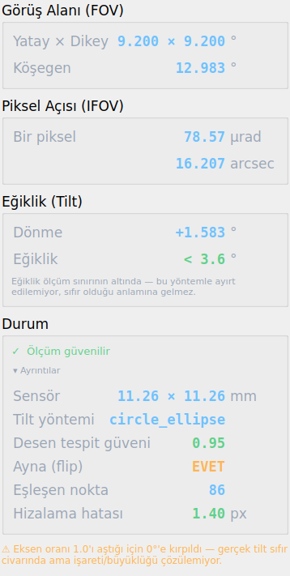

# OPTİK ANALİZ — KULLANIM KILAVUZU

**Sürüm:** 2.0 · **Tarih:** 12 Ağustos 2026
**Proje konumu:** `/home/test123/Desktop/optik_analiz/`

---

## 1. YAZILIM NE YAPAR?

İki görüntüyü karşılaştırır:

- **Ground truth (GT):** OLED ekrana yansıtılan, bilinen test deseni (WTW Camera Test Chart)
- **Dedektör görüntüsü:** Lens + dedektör üzerinden çekilen gerçek görüntü

Bu karşılaştırmadan üç optik parametreyi **otomatik** hesaplar:

| Parametre | Anlamı |
|---|---|
| **FOV** (Field of View) | Sensörün gördüğü toplam açı |
| **IFOV** (Instantaneous FOV) | Tek bir pikselin gördüğü açı |
| **Tilt** | Görüntüdeki eğiklik — hem düzlem-içi dönme hem düzlem-dışı perspektif |

### Tasarımın temel ilkesi: PARAMETRİK

Hiçbir donanım değeri koda gömülü değildir. Lens, dedektör veya OLED değişirse
**sadece arayüzdeki alanları güncellersiniz** — matematik otomatik olarak yeni
değerlere göre kurulur.

### Mevcut donanım

| Bileşen | Model | Kritik değerler |
|---|---|---|
| Lens | Rodenstock HR Digaron-W | f = 70 mm, f/5.6 |
| Dedektör | CMV4000 (ams/OSRAM) | 2048×2048 px, pitch 5.5 µm (11.26×11.26 mm) |
| OLED | GL049AMN10A (Guangli 0.49") | 1920×1080, pitch 5.616 µm |

**Düzenek:** Kollimatör YOK → pinhole (delik-iğne) kamera modeli kullanılıyor.

---

## 2. PROJEYİ VS CODE'DA AÇMA

### Yol A — Terminalden

```bash
code /home/test123/Desktop/optik_analiz
```

### Yol B — VS Code arayüzünden

`File → Open Folder…` → `/home/test123/Desktop/optik_analiz` → **Open**

> Proje zaten VS Code'da açıksa, sol taraftaki dosya ağacında `core/`, `gui/`,
> `presets/` klasörlerini görürsünüz.

---

## 3. ARAYÜZÜ BAŞLATMA

İki yol vardır; ikisi de aynı işi yapar.

### Yol A — VS Code içinden (en kolay)

**F5** tuşuna basın. Hazır yapılandırma listesi açılır:

| Yapılandırma | Ne yapar |
|---|---|
| **Arayüzü başlat (GUI)** | ← Normalde bunu kullanın |
| Uçtan uca test (görüntülerle) | Örnek görüntülerle tam akışı koşturur |
| Sentetik tilt doğrulaması | Ölçüm doğruluğunu sınar (görüntü gerekmez) |
| Çekirdek test | Sadece matematiği sınar |

### Yol B — Terminalden

VS Code'da **Ctrl + `** (backtick) ile terminal açın:

```bash
cd /home/test123/Desktop/optik_analiz
python3 run_gui.py
```

---

## 4. ARAYÜZÜ KULLANMA — 4 ADIM

Pencere açıldığında üç panel görürsünüz: **sol** (girdi), **orta** (görüntüler),
**sağ** (sonuçlar).


---

### ADIM 1 — Görüntüleri seçin (sol üst)

- **"Ground truth seç…"** → referans desen görüntüsü
- **"Dedektör görüntüsü seç…"** → dedektörden çekilen görüntü

Desteklenen biçimler: PNG, JPG, JPEG, BMP, TIF, TIFF

Seçer seçmez görüntü, orta paneldeki ilgili sekmede belirir.

> **Örnek çift (test için):**
> GT: `Downloads/WhatsApp Image 2026-08-11 at 15.54.53 (1).jpeg`
> Dedektör: `Downloads/WhatsApp Image 2026-08-11 at 15.54.53.jpeg`

---

### ADIM 2 — Parametreleri kontrol edin (sol panel)

Donanım değerleri **zaten dolu gelir.** Donanım değişmediyse hiçbir şeye
dokunmanıza gerek yoktur.

Üç grup vardır: **Lens**, **Dedektör**, **OLED**.

Bir değeri değiştirdiğinizde "Sensör alanı" satırı **canlı güncellenir** —
doğru girdiğinizi oradan teyit edebilirsiniz.

---

### ADIM 3 — ANALİZ ET

Sol panelin altındaki mavi **ANALİZ ET** butonuna basın.

- Analiz **arka planda** koşar, arayüz donmaz
- Alt kısımdaki çubuk ilerlemeyi gösterir
- Tipik süre: birkaç saniye

---

### ADIM 4 — Sonuçları okuyun (sağ panel)

Sağ panel üç ölçüm + bir durum satırından oluşur:

| Bölüm | Cevapladığı soru |
|---|---|
| **Görüş Alanı (FOV)** | Sensör ne kadar geniş bir alan görüyor? |
| **Piksel Açısı (IFOV)** | Tek bir piksel ne kadar açı görüyor? |
| **Eğiklik (Tilt)** | Görüntüde ne kadar eğiklik var? |
| **Durum** | Bu sonuca güvenebilir miyim? |

**Renk kodu:** 🟢 yeşil = iyi · 🟡 sarı = dikkat · 🔴 kırmızı = sorunlu

---

## 5. SAĞ PANELDEKİ HER SATIR NE ANLATIYOR?



### Görüş Alanı (FOV)

Sensörün gördüğü **toplam açı**. Bu değerler görüntüden bağımsızdır —
yalnızca girdiğiniz lens ve dedektör parametrelerinden hesaplanır. Aynı
donanımla her analizde aynı çıkarlar.

| Satır | Anlamı |
|---|---|
| **Yatay × Dikey** | Sensörün yatay ve dikey yönde gördüğü açı. Kare sensörde ikisi eşittir. |
| **Köşegen** | Köşeden köşeye görüş açısı. Yatay/dikeyden büyüktür. |

> **Örnek:** 9.200° × 9.200° — sistem 9.2 derecelik kare bir alan görüyor.
> Köşegen 12.983°.

### Piksel Açısı (IFOV)

**Tek bir pikselin** gördüğü açı. Sistemin ayırt etme gücünü verir: iki
nesne bu açıdan daha yakınsa aynı piksele düşer ve birbirinden ayırt
edilemez.

| Satır | Anlamı |
|---|---|
| **Bir piksel** (µrad) | Piksel açısı, mikroradyan cinsinden |
| (arcsec) | Aynı değerin yay-saniyesi cinsinden yazımı |

İki satır **aynı büyüklüğün** iki farklı birimidir; hangisi işinize
geliyorsa onu kullanın. Piksel kare değilse (pitch X ≠ Y) ilk satır
`78.57 × 80.12` gibi iki değer gösterir.

> **Dikkat:** IFOV çözünürlükten **bağımsızdır**. Sensörü 2048'den 1024
> piksele düşürürseniz FOV yarıya iner ama IFOV değişmez — tek pikselin
> açısı, kaç piksel olduğuyla ilgili değildir.

### Eğiklik (Tilt)

| Satır | Anlamı |
|---|---|
| **Dönme** | Görüntünün kendi düzleminde saat yönünde dönmesi. Kamerayı hafifçe yamuk tutmak gibi — perspektif bozulması yaratmaz. |
| **Eğiklik** | Dedektör düzleminin hedefe göre eğikliği. Asıl aradığınız tilt budur. |

Eğiklik satırının altında küçük puntoyla **belirsizlik** yazar. İki
biçimden biri görünür:

- **`1.830°`** ve altında `belirsizlik ± 0.35°` →
  ölçüm başarılı, değer güvenilir.
- **`< 3.6°`** ve altında *"ölçüm sınırının altında"* →
  eğiklik var olabilir ama bu yöntemle **ayırt edilemiyor**.

> **Bu ayrım kritiktir.** `< 3.6°` yazması "tilt sıfır" demek DEĞİLDİR;
> "tilt bu değerden küçük, tam sayısı ölçülemiyor" demektir. Yöntem küçük
> açılarda doğası gereği duyarsızdır (bkz. Teknik Ek).

### Durum

Tek satırda **"bu sonuca güvenebilir miyim"** sorusunun cevabı:

| Gösterge | Anlamı | Ne yapmalı |
|---|---|---|
| 🟢 **✓ Ölçüm güvenilir** | Desen net bulundu, hizalama sağlam | Sonucu kullanabilirsiniz |
| 🟡 **⚠ Dikkat** | Ölçüm yapıldı ama bir zayıflık var | Sebebi okuyun, overlay'e bakın |
| 🔴 **⛔ Sonuca güvenmeyin** | Desen seçilemedi | Görüntü kalitesini düzeltin, tekrar çekin |

**▸ Ayrıntılar** satırına tıklarsanız teknik veriler açılır. Normal
kullanımda bunlara bakmanız gerekmez; sorun teşhisi için dururlar:

| Satır | Anlamı |
|---|---|
| **Sensör** | Sensörün fiziksel boyutu (mm). Parametreleri doğru girdiğinizi teyit eder. |
| **Tilt yöntemi** | Eğikliği hangi yöntemin ölçtüğü. `circle_ellipse` = dairesel desenden (güvenilir). |
| **Desen tespit güveni** | Yıldızın ne kadar net bulunduğu. 0.7 üstü iyidir. |
| **Ayna (flip)** | Görüntü aynalanmış mı. **EVET normaldir** — optik düzenekten gelir, yazılım telafi eder. |
| **Eşleşen nokta** | İki görüntü arasında kaç ortak nokta bulundu. Yüksek = iyi. |
| **Hizalama hatası** | Görüntülerin üst üste oturma hatası (piksel). 2 px altı iyidir. |

---

## 6. SONUÇLARI YORUMLAMA

### Örnek çıktı (doğrulanmış referans değerler)

| Ölçüm | Değer |
|---|---|
| FOV | 9.200° × 9.200° (köşegen 12.983°) |
| IFOV | 78.57 µrad/px (16.207 arcsec/px) |
| Dönme | +1.583° |
| Eğiklik | < 3.6° (ölçüm sınırının altında) |
| Durum | ✓ Ölçüm güvenilir |

### ⚠️ ÖNEMLİ: "< 3.6°" ne demek, "0°" neden yazmıyor?

Eğiklik satırında bazen kesin bir sayı yerine **üst sınır** görürsünüz.
Bunun sebebi yöntemin fiziğidir.

Eğiklik, merkezi yıldızın elips oranından ölçülür:

```
eksen oranı (b/a) = cos(eğiklik)
```

Kosinüs sıfır civarında **çok yassıdır**. 1° eğiklik oranı yalnızca 0.00015
değiştirir — bu, ölçüm gürültüsünün altında kalır. Yani küçük açılarda
oran ile açı arasındaki bağ kopar.

| Gerçek eğiklik | Eksen oranı | Ölçülebilir mi? |
|---|---|---|
| 0° | 1.0000 | — |
| 1° | 0.9998 | ❌ gürültüde kaybolur |
| 3° | 0.9986 | ⚠️ sınırda |
| 5° | 0.9962 | ✅ evet |
| 20° | 0.9397 | ✅ rahatlıkla |

Bu yüzden yazılım küçük açılarda **"< 3.6°"** yazar. Eskiden bu durumda
`0.000°` yazıyordu ve bu yanıltıcıydı: ölçülememiş bir değer, kesin bir
sıfır gibi görünüyordu.

> **Özet:** `< 3.6°` = "eğiklik bu değerden küçük, tam sayısı bu yöntemle
> çıkarılamıyor." Sıfır olduğunu **kanıtlamaz**.

Küçük eğiklikleri hassas ölçmeniz gerekiyorsa mevcut yöntem yetersizdir;
farklı bir referans geometri (bilinen ızgara/işaret deseni) gerekir.

### Dönme ile eğiklik farkı

Bu ikisi **farklı** büyüklüklerdir, karıştırmayın:

| | Ne olur | Nasıl ölçülür |
|---|---|---|
| **Dönme** | Görüntü kendi düzleminde döner; daire daire kalır | SIFT eşleşmelerinden homografi |
| **Eğiklik** | Düzlem hedefe göre eğilir; daire elipse döner | Yıldız elipsinin eksen oranı |

Kamerayı yamuk tutmak dönme yaratır. Kamerayı hedefe eğik tutmak eğiklik
yaratır. Biri diğerinden bağımsız olarak var olabilir.

---

## 7. SAĞLIK KONTROLÜ — SONUCA GÜVENEBİLİR MİYİM?

İlk bakılacak yer **Durum** satırıdır; yazılım kontrolü sizin yerinize
yapar. 🟢 yeşil görüyorsanız aşağıdaki kontroller zaten geçmiş demektir.
Sarı veya kırmızı görüyorsanız sebebini bu üç kontrolle bulun:

### Kontrol 1 — Overlay sekmesine bakın

Orta panelde **"Hizalama (overlay)"** sekmesini açın.


- **Geniş sarı alanlar** → iki görüntü üst üste oturmuş ✅
- **Kırmızı ve yeşil hayaletler ayrışmış** → hizalama tutmamış ❌
  (bu durumda tilt değerine güvenmeyin)

İnce renkli kenar çizgileri normaldir — sub-piksel kaymayı gösterir.

### Kontrol 2 — Elipsin yerine bakın

**"Ground truth"** ve **"Dedektör"** sekmelerinde yeşil elips, **merkezi
yıldızın dış sınırına** oturmalıdır.


Elips çok büyük (tüm chart'ı kapsıyor) veya çok küçükse tespit başarısızdır.

### Kontrol 3 — Güven skorunu okuyun

**▸ Ayrıntılar**'ı açıp **Desen tespit güveni** satırına bakın. **0.7'nin
altındaysa** merkezi yıldız net seçilememiştir. Görüntüde yıldızın tam
görünür ve odakta olduğundan emin olun.

---

## 8. PARAMETRELERİ DEĞİŞTİRME VE PRESET'LER

### Donanım değişirse

İlgili alanı değiştirip tekrar **ANALİZ ET** deyin. Matematik otomatik akar:

| Değişiklik | Etkisi |
|---|---|
| Lens f iki katına (70 → 140 mm) | FOV yarıya, IFOV yarıya |
| Piksel pitch iki katına (5.5 → 11 µm) | IFOV iki katına |
| Çözünürlük yarıya (2048 → 1024 px) | FOV yarıya, **IFOV değişmez** |
| Dikdörtgen piksel (pitch X ≠ Y) | IFOV X ve Y farklı hesaplanır |

> IFOV'un çözünürlükten bağımsız olması doğrudur — IFOV tek pikselin açısıdır,
> kaç piksel olduğuyla ilgisi yoktur.

### Preset kaydetme / yükleme

Sol paneldeki **Preset** grubunda:

- **Kaydet…** → mevcut tüm parametreleri JSON olarak `presets/` altına yazar
- **Yükle…** → kayıtlı bir preset'i geri çağırır
- **Varsayılan** → her şeyi mevcut donanıma (70mm + CMV4000 + GL049) döndürür

Farklı lens/dedektör kombinasyonlarıyla çalışıyorsanız her biri için bir preset
kaydedin.

---

## 9. TESTLER

### Sentetik doğrulama (görüntü gerekmez)

```bash
python3 test_tilt_synth.py
```

Bilinen açılarla eğilmiş yapay Siemens star üretir ve ölçümün bu değeri geri
verip vermediğini kontrol eder.

**Mevcut sonuç:** 0°–40° arasında en büyük hata **0.29°**. Mükemmel dairede
eksen oranı tam 1.0000 (sıfır sistematik sapma).

Ölçümden şüphelenirseniz ilk çalıştıracağınız test budur.

### Ölçüm katmanı doğrulaması

```bash
python3 test_tilt_multi.py
```

Çoklu tilt ölçüm katmanını sınar. İki şeyi birden kontrol eder:

1. **Doğruluk** — bilinen açılar geri okunabiliyor mu
2. **Dürüstlük** — ölçülemeyen durumlarda sayı **uydurulmuyor** mu

İkincisi en az birincisi kadar önemlidir: desensiz bir görüntü verildiğinde
sistem "ölçülemedi" demeli, sıfır üretmemelidir.

### Uçtan uca test (örnek görüntülerle)

```bash
python3 test_pipeline.py
```

Tam akışı koşturur, sonuçları yazdırır ve `data/` altına önizleme PNG'leri
kaydeder.

### Çekirdek test

```bash
python3 test_core.py
```

Sadece FOV/IFOV matematiğini ve görüntü eşlemeyi sınar.

---

## 10. SORUN GİDERME

| Belirti | Olası sebep | Çözüm |
|---|---|---|
| "Görüntü eksik" uyarısı | GT veya dedektör seçilmemiş | Her iki görüntüyü de seçin |
| Eğiklik satırında **"ölçülemedi"** | Görüntüde dairesel desen yok | Merkezi yıldızın göründüğü bir görüntü kullanın |
| Eğiklik **"< 3.6°"** yazıyor | Eğiklik yöntemin çözünürlük sınırının altında | Normal davranış — bkz. bölüm 6 |
| Durum **⛔ kırmızı** | Desen net seçilemedi | Odak / aydınlatma / kontrast iyileştirin |
| Durum **⚠ sarı**, "az sayıda ortak nokta" | Görüntüler az örtüşüyor | Aynı desenin çekimleri olduğundan emin olun |
| "Görüntüler eşleştirilemedi" | Görüntüler çok farklı | Dönme ölçülemez; eğiklik yine de elipsten ölçülür |
| Overlay'de kırmızı/yeşil ayrışmış | Hizalama tutmamış | Sonuca güvenmeyin; görüntü kalitesini artırın |
| Arayüz açılmıyor | PyQt5 sorunu | `python3 -c "import PyQt5; print('OK')"` ile kontrol edin |

### Ortam gereksinimleri

Python 3.12 ile şu paketler kurulu olmalı (hepsi mevcut sistemde kurulu):

```
OpenCV 4.13 · NumPy 1.26 · SciPy 1.11 · PyQt5 5.15 · matplotlib 3.10
```

---

## 11. TEKNİK EK — ÖLÇÜM NASIL YAPILIYOR?

### FOV / IFOV — pinhole modeli

Kollimatör olmadığı için doğrudan pinhole kamera modeli kullanılır:

```
IFOV = 2 · arctan( pitch / (2f) )          [tek piksel açısı]
FOV  = 2 · arctan( (N · pitch) / (2f) )    [tüm sensör]
```

- `f` = lens odak uzaklığı
- `pitch` = dedektör piksel pitch'i
- `N` = piksel sayısı

Bu değerler **görüntüden bağımsızdır** — yalnızca sistem parametrelerinden gelir.

### Tilt — Siemens star elips yöntemi

Test chart'ının merkezindeki büyük radyal desen (Siemens star) gerçekte bir
**dairedir**. Eğik bir düzlemde görüntülenince **elipse** dönüşür:

```
eksen oranı (b/a) = cos(tilt açısı)   →   tilt = arccos(b/a)
```

Bu geometrik ilişki **ölçek ve kırpmadan bağımsız** olduğu için, farklı
çözünürlükteki görüntüleri karşılaştırırken bile geçerlidir.

**Yıldızı diğer desenlerden nasıl ayırıyoruz?** Chart'ta köşe yıldızları, metin
ve çerçeve de yüksek kenar enerjisine sahiptir. Ayırt edici özellik şudur:
merkezi yıldızın **içindeki** her yarıçap halkasında, açısal yönde çok sayıda
siyah-beyaz geçiş vardır (~110). Yıldız bitince bu sayı keskin düşer. Profildeki
**ilk kalıcı düşüş** yıldızın sınırıdır.

#### Yöntemin çözünürlük sınırı — neden küçük açılar ölçülemez

Eksen oranından açıya geçerken türev şudur:

```
tilt = arccos(r)   →   d(tilt)/dr = -1 / √(1 - r²)
```

`r → 1` (küçük tilt) iken bu ifade **patlar**: aynı miktar oran gürültüsü,
çok daha büyük bir açı belirsizliğine karşılık gelir. Tersi de doğrudur —
küçük açılarda oran neredeyse hiç değişmez, dolayısıyla açı oranın içinde
kaybolur.

Tipik oran ölçüm gürültüsü σ ≈ 0.002'dir. Bunun gizleyebileceği en büyük
açı:

```
arccos(1 - 0.002) ≈ 3.6°
```

Bu, yöntemin **fiziksel çözünürlük sınırıdır**. Yazılım bu sınırın altındaki
ölçümleri sayı olarak değil, üst sınır olarak (`< 3.6°`) raporlar.

**Ölçüm katmanı** (`core/tilt_estimators.py`) bunu şöyle yönetir:

- Her yöntem kendi **belirsizliğini** (σ) hesaplar
- Ölçüm σ'dan büyükse "çözülebilir", değilse üst sınır olarak sunulur
- Eksen oranı 1.0'ı aşarsa (fiziksel olarak imkânsız) `clamped` işaretlenir
- Desen tespit güveni 0.7'nin altındaysa ölçüm **üretilmez** — olmayan
  desenden sayı uydurulmaz
- Doğrulanmamış yöntemler (`experimental`) birincil ölçüm olarak seçilmez

### Dönme — homografi

Düzlem-içi dönme, SIFT özellik eşleşmelerinden hesaplanan homografinin
QR ayrıştırmasından gelir. Homografi **dejenerelik denetiminden** geçirilir:
izdüşen dörtgenin alanı, kenar oranları, dışbükeyliği ve ölçeği kontrol edilir.
Denetimi geçemeyen homografiler reddedilir ve tilt yalnızca elipsten ölçülür.

> **Not:** Bu denetim kritik. Siemens star'ın kendine-benzer deseni, SIFT'in
> merkez çevresinde sahte eşleşmeler üretmesine yol açar; denetim olmadan
> RANSAC bunları "görüntüyü tek noktaya çökerten" geçersiz bir dönüşümle
> açıklayabilir ve tamamen yanlış bir dönme değeri üretebilir.

---

## PROJE DOSYA YAPISI

```
optik_analiz/
├── core/
│   ├── config.py          Parametrik config (Lens/Detector/OLED) + JSON
│   ├── optics.py          FOV/IFOV hesabı + homografi ayrıştırma
│   ├── image_analysis.py  SIFT eşleme, ayna tespiti, dejenerelik denetimi
│   ├── siemens_star.py    Elips-fit tilt ölçümü
│   ├── tilt_estimators.py Çoklu tilt yöntemi + belirsizlik raporlama
│   └── pipeline.py        Tüm akışı birleştiren giriş noktası
├── gui/
│   ├── main_window.py     Ana pencere (3 panel + arka plan thread)
│   └── widgets.py         Tema, görüntü göstericisi, sonuç satırları
├── docs/                  Bu kılavuz (md/html/pdf) + görseller
├── presets/               Preset JSON'ları
├── data/                  Debug/önizleme çıktıları
├── run_gui.py             ← Arayüzü başlatır
├── test_core.py           Çekirdek test
├── test_pipeline.py       Uçtan uca test
├── test_tilt_synth.py     Sentetik doğrulama
├── test_tilt_multi.py     Ölçüm katmanı doğrulaması
└── DEVAM_YONERGESI.md     Geliştirme durumu ve teknik notlar
```

---

*Bu kılavuz projedeki `docs/` klasörü altındadır.
Geliştirme durumu ve teknik detaylar için `DEVAM_YONERGESI.md`
dosyasına bakınız.*
